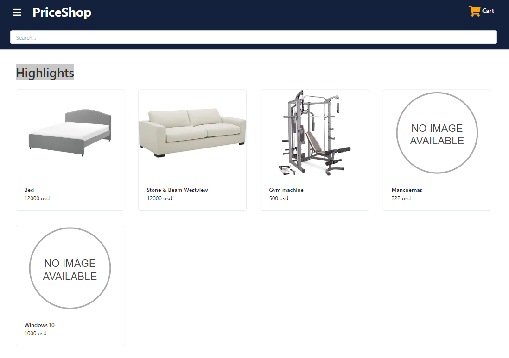

# PriceShop e-commerce



Full-Stack E-commerce App.

**Technologies:**

- Next.js
- Typescript
- Responsive Design
- Chakra UI
- Prisma
- SWR
- Debounce
- Context API

## Installation

1. Create an empty postgres database and create a `.env` file (see `.example.env` file) to define environment variables
2. Use the query defined in `prisma/seed.db` to seed the database.
3. Install libreries: `npm install`

## Start

```
npm run dev
```
